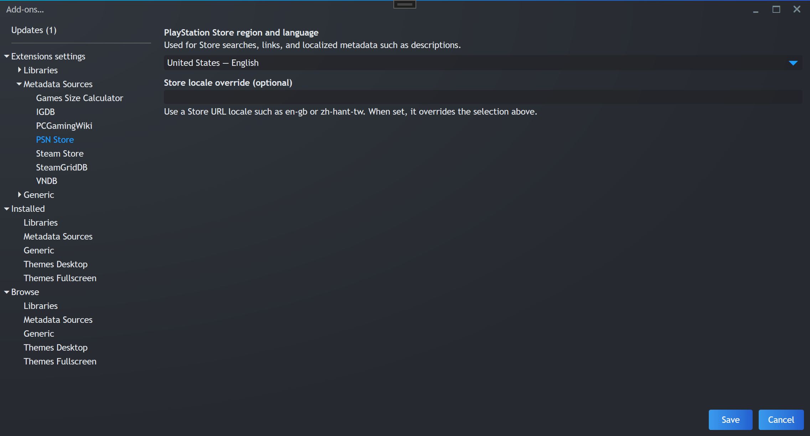
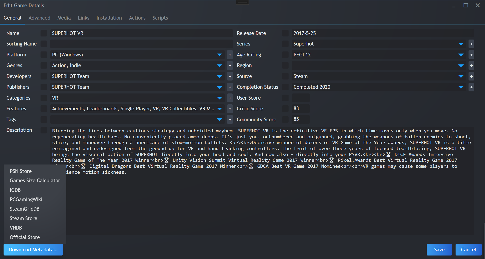
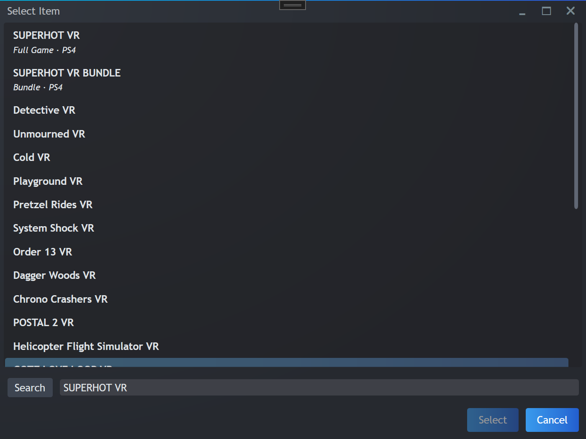
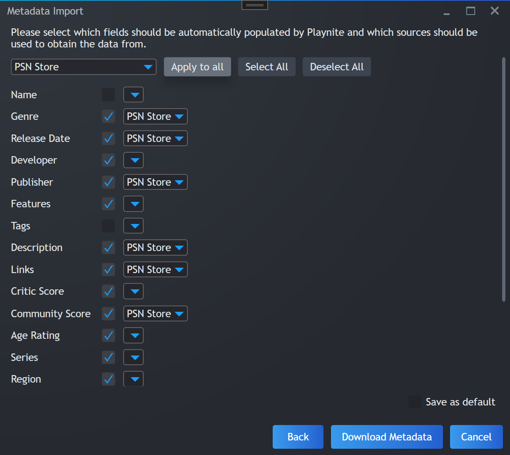
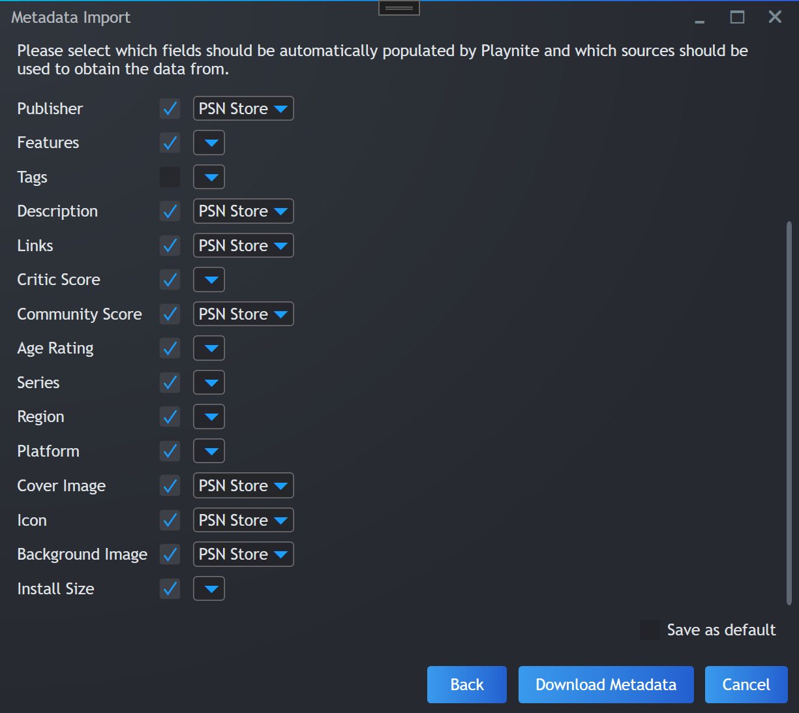

## About

Universal PSN Metadata is a Playnite metadata source that searches the PlayStation Store and imports available Store metadata, including descriptions, genres, publisher, release date, community score, links, and artwork.

Choose a Store region and language for localized search results and metadata. The preset list covers common Store locales; an optional override accepts any Store URL locale, such as `en-gb` or `zh-hant-tw`.

Work based on [JosefNemec/PlayniteExtensions](https://github.com/JosefNemec/PlayniteExtensions/).

## Screenshots

### Store locale settings

### Single-game metadata download

### Multiple-game metadata download

